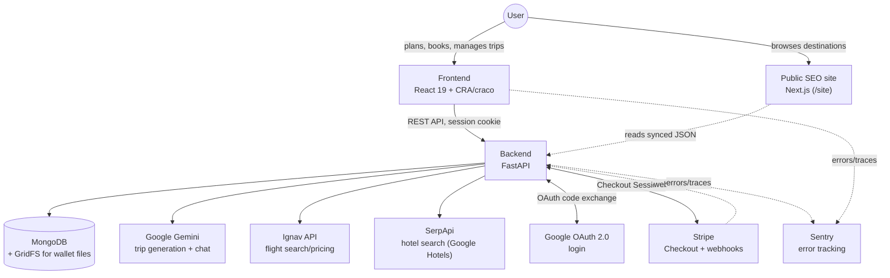

# EYV — Enjoy Your Vacation

EYV is an AI-powered trip-planning app. A user answers a short questionnaire
(destination, dates, party size, transportation mode, budget) and gets back
three priced itinerary tiers — Budget / Premium / Luxury — generated by
Gemini and anchored to real flight/hotel pricing where a live quote is
available. From there they can save trips, chat with an AI assistant about
a saved itinerary, book the real (flight + hotel) portion of a plan through
Stripe, and earn/redeem loyalty points.

This is a solo-founder production app, not a demo — treat "known gaps"
below as real, not boilerplate disclaimers.

## Architecture



- **Frontend** (`frontend/`) — React 19, Create React App via
  [craco](https://craco.js.org/), Tailwind CSS, [shadcn/ui](https://ui.shadcn.com/)
  components on top of Radix primitives, Framer Motion, React Router 7,
  Axios, React Hook Form, Leaflet/react-leaflet for the road-trip map,
  Sonner for toasts, TanStack Query.
- **Backend** (`backend/`) — FastAPI + [Motor](https://motor.readthedocs.io/)
  (async MongoDB driver), Pydantic v2, served by Uvicorn. All routes live
  under `/api` in `backend/server.py`; provider integrations and other
  cross-cutting concerns live in `backend/services/`.
- **Database** — MongoDB. Also backs file storage directly (wallet uploads
  go into a GridFS bucket via `services/storage_service.py`) — there's no
  S3 or other object storage in this app.
- **Auth** — real Google OAuth 2.0, implemented directly against Google's
  endpoints (no auth-as-a-service). Session tokens are SHA-256 hashed at
  rest, set as an `HttpOnly`/`Secure`/`SameSite=None` cookie, support
  multiple concurrent sessions per user, and can be listed/revoked from the
  account UI.
- **AI** — Google Gemini (`google-genai` SDK) for both trip generation and
  the in-app chat assistant. The Gemini client is a lazy singleton so a
  missing/invalid key only breaks the specific request that needed it, not
  the whole process.
- **Flights** — [Ignav](https://ignav.com) (`services/ignav_service.py`).
  Train and cruise pricing are hardcoded estimate tables (no real-time
  inventory exists for either); road-trip pricing is a computed fuel/toll
  estimate grounded in geocoded driving distance.
- **Hotels** — SerpApi's Google Hotels engine (`services/serpapi_hotels_service.py`).
- **Geocoding** — `services/locations_service.py` (a curated destination
  list + Nominatim), with `services/amadeus_service.py` supplying mock
  coordinates as a last-resort fallback so a map always has *something* to
  plot.
- **Payments** — Stripe Checkout, for both premium subscriptions and
  one-time bookings (only the real flight/hotel portion of a plan is ever
  actually charged — activities/meals stay informational estimates).
  Payment completion is reconciled from **two** independent paths — the
  `checkout.session.completed` webhook and a frontend poll of
  `/api/payments/status/{id}` — both racing to be the one that marks a
  payment "paid"; this is handled with an atomic, filtered DB update so
  only one of them ever applies the payment.
- **Rewards** — a points/tier system (`services/rewards_service.py`):
  points are earned on bookings/subscriptions and redeemable for a
  discount on a future booking.
- **Public SEO site** (`site/`) — a separate, minimal Next.js app for
  public destination pages (crawlable, no auth). It doesn't call the
  backend at request time; destination data is exported to a static JSON
  file (`site/scripts/export-locations.py`, `site/scripts/sync-content.js`)
  and committed, re-run manually whenever the source data changes.

## Repo layout

```
backend/          FastAPI app (server.py) + services/ + tests/
frontend/          React app (CRA/craco) + e2e/ (Playwright)
site/               Next.js public SEO site
docs/               Design reference docs
.github/workflows/  CI (ci.yml)
docker-compose.yml  Local Mongo + backend, dev convenience only
```

## Running it locally

**Prerequisites:** Python 3.12, Node 20, Yarn, and a MongoDB instance
reachable at `MONGO_URL` (either `docker compose up -d mongo`, or a local
`mongod`).

### Backend

```
cd backend
python -m venv venv
venv/Scripts/activate        # venv\Scripts\activate.ps1 on Windows PowerShell; source venv/bin/activate on macOS/Linux
pip install -r requirements.txt
cp .env.example .env         # fill in real values - see below
python -m uvicorn server:app --reload --port 8001
```

`server.py` raises at import time (on purpose) if `CORS_ORIGINS` or
`WALLET_URL_SIGNING_SECRET` aren't set — every other integration
(Gemini/Stripe/Ignav/SerpApi/Google OAuth/Sentry) degrades gracefully
without its key rather than crashing the whole process, so you can run the
app locally with only a subset of real credentials configured. See
`backend/.env.example` for the full list and what each one gates.

### Frontend

```
cd frontend
yarn install
yarn start          # http://localhost:3000, expects the backend at :8001 (see .env)
```

### Docker Compose (Mongo + backend only)

```
docker compose up -d
```

Local dev convenience only — see the comment at the top of
`docker-compose.yml`. The backend image is a plain `docker build` (no
source bind-mount), so it does **not** hot-reload; rebuild
(`docker compose up -d --build backend`) after backend code changes, or
just run the backend outside Docker (above) for active development.

## Tests & CI

Everything below runs in `.github/workflows/ci.yml` on every push/PR to
`main`.

- **`gitleaks`** — secret scanning (same config the local pre-commit hook
  uses).
- **`backend-tests`** — the original integration suite
  (`backend/tests/backend_test.py`, `test_new_features.py`,
  `test_auth_security.py`, `test_rewards_payments.py`,
  `test_group_pricing.py`, `test_hotel_data_integrity.py`,
  `test_log_redaction.py`, `test_plan_generation_crash.py`, plus a few
  live-Gemini/regeneration files run manually, not gated on) — drives a
  **real running backend** over HTTP against a Mongo service container,
  authenticating via a session seeded directly into Mongo
  (`backend/tests/conftest.py`), not a hardcoded token.
- **`backend-unit-tests`** — a faster, newer in-process suite
  (`test_road_pricing.py`, `test_rewards_math.py`,
  `test_pricing_recompute_invariant.py`, `test_payment_webhook_race.py`)
  that calls the FastAPI app directly (`starlette.testclient.TestClient` /
  `httpx.ASGITransport`) — no live server process needed. This is where
  the money-path coverage lives: pricing recompute, rewards math, and a
  regression test for the webhook/poll payment race described above.
- **`playwright-smoke`** — `frontend/e2e/` (see its own README) - five
  shallow smoke specs (login entry point, authenticated access, trip
  generation, viewing a trip, a booking flow) against the real
  frontend+backend+Mongo stack. Not exhaustive UI coverage on purpose —
  catches "the app is completely broken," nothing deeper.
- **`docker-build`** / **`frontend-build`** / **`site-build`** — build
  gates for the three deployables.

Run things locally the same way CI does:

```
# Backend - both live-server and in-process suites live under backend/tests/
cd backend && pytest tests/

# Frontend unit tests (src/lib/*.test.js)
cd frontend && yarn test

# Playwright smoke suite - boots both frontend and backend itself
cd frontend && yarn test:e2e
```

### Local Stripe webhook testing

The backend has a real webhook handler at `POST /api/webhook/stripe` (see
`backend/server.py`) that Stripe calls directly, not through the frontend —
so exercising it locally requires forwarding Stripe's events to your
machine with the Stripe CLI, rather than just clicking through the UI.

**1. Get the Stripe CLI.** A portable Windows binary is vendored at
`backend/tools/stripe-cli/stripe.exe` (not committed to git — see
`backend/tools/.gitignore`). If it's missing, download it yourself:

```
curl -sL -o stripe.zip https://github.com/stripe/stripe-cli/releases/latest/download/stripe_<version>_windows_x86_64.zip
unzip stripe.zip   # produces stripe.exe
```

(`choco install stripe-cli` also works if you have an elevated/admin shell
— it fails silently otherwise with a `lib-bad` permissions error.)

**2. Authenticate.** The app's own `STRIPE_API_KEY` in `.env` is a
*restricted* key scoped to what the app itself needs, and does not have the
`stripecli_session_write` ("Debugging Tools Write") permission that
`stripe listen`/`stripe trigger` require. Rather than widen that key's
permissions, pair the CLI with your Stripe account directly:

```
backend/tools/stripe-cli/stripe.exe login
```

This opens a browser to confirm the pairing and stores a separate CLI
credential (`~/.config/stripe/config.toml`), untouched by and unrelated to
the app's own `.env` key.

**3. Forward events to your local backend:**

```
backend/tools/stripe-cli/stripe.exe listen --forward-to localhost:8001/api/webhook/stripe
```

This prints `Your webhook signing secret is whsec_...` on startup. Copy
that value into `STRIPE_WEBHOOK_SECRET` in `backend/.env` and **restart the
backend** — `.env` is only read once at process startup (`load_dotenv` in
`server.py`), so the running process won't pick up a changed secret on its
own.

**Important:** this signing secret is ephemeral — `stripe listen` mints a
new one every time it's (re)started, unless you switch to
`--use-configured-webhooks` against a webhook endpoint registered in the
Stripe Dashboard (which has a stable secret). For local dev, just re-copy
the secret and restart the backend each time you restart `stripe listen`.

**4. Fire test events** (in a second terminal, while `stripe listen` is
running):

```
backend/tools/stripe-cli/stripe.exe trigger checkout.session.completed
backend/tools/stripe-cli/stripe.exe trigger checkout.session.expired
```

Each should show up in the `stripe listen` terminal as `--> event.name` /
`<-- [200] POST .../webhook/stripe`, and in the backend's own logs as
`POST /api/webhook/stripe HTTP/1.1" 200 OK`. A non-200 here usually means
the `STRIPE_WEBHOOK_SECRET` the backend has loaded doesn't match the one
`stripe listen` most recently printed.

## Known gaps

Being direct about the current state rather than overselling it:

- A handful of tests in the older live-server integration suite
  (`backend-tests`) are known-failing and tracked, not silently ignored —
  two reference a Gemini client attribute that moved during a lazy-init
  refactor, one uses a cached-anchor test fixture that predates a later
  pricing field, and a few live-endpoint tests are sensitive to real rate
  limits when the full suite runs back-to-back. None of these are gating
  CI (`backend-tests` runs a curated, stable subset); they're on the list
  to actually fix, not a hidden asterisk.
- `rewards_service.redeem_points` has the same class of race the payment
  webhook/poll path used to have (read-balance-then-write, not atomic) —
  unlike the webhook/poll case, this one hasn't been fixed yet.
- The Docker Compose backend image doesn't hot-reload (see above) — fine
  for "spin up a working stack," not for active backend development.
- Train and cruise pricing are hardcoded estimate tables, not real
  provider quotes — there's no accessible real-time inventory API for
  either, and this is surfaced honestly to the user in the UI
  (`*_placeholder_pricing` flags), not hidden.
- Itinerary generation and hotel-search pricing disagree on how many
  nights a `departure_date`/`return_date` range covers. `generate_single_plan`
  treats `return_date` as its own full itinerary day and force-charges a
  full night's accommodation on it (confirmed by
  `test_pricing_recompute_invariant.py`/`test_cruise_pricing.py`, and by
  live Gemini eval runs — a 3-day date gap consistently produced 4
  itinerary days). `serpapi_hotels_service.py`/`amadeus_service.py`
  compute nights as a plain `(check_out - check_in).days`, no `+1`. Same
  dates, two different night counts — a generated itinerary's
  accommodation total ends up one night pricier than what the
  hotel-search step itself would quote for the identical stay. Not fixed
  yet, tracked here so it doesn't get lost.
